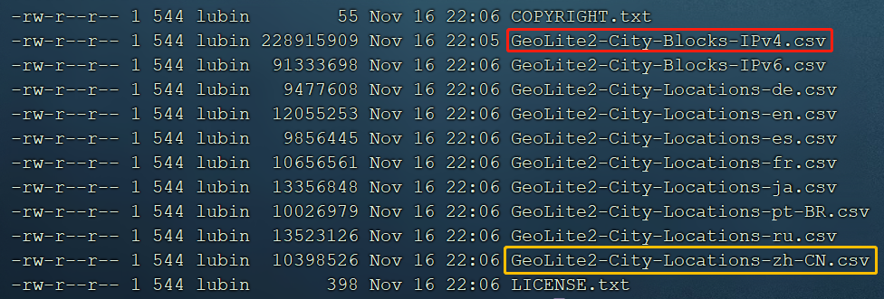
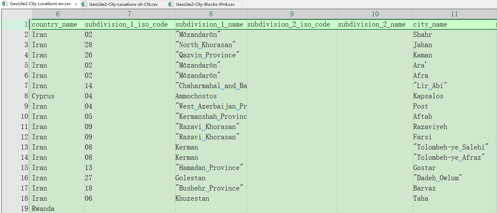

# 如何制作 mmdb 文件

> [MaxMind-DB-Writer - Create MaxMind DB database files](https://metacpan.org/release/MaxMind-DB-Writer)
> 
> [MaxMind::DB::Writer::Tree - API Doc](https://metacpan.org/pod/MaxMind::DB::Writer::Tree)

mmdb 的制作需要使用官方工具 [MaxMind-DB-Writer-perl](https://github.com/maxmind/MaxMind-DB-Writer-perl)。这是一个 Perl 语言编写的工具。

## 为什么要自己制作 mmdb 文件

- 可以添加自定义配置, 例如官方提供的mmdb中没有保留的局域网地址(10.0.0.0/8, 172.16.0.0/12, 192.168.0.0/16)

- 可以对官方提供的 mmdb 进行精简, 官方提供的mmdb包含多国语言, city库70M,我们可以只保留中文,减小mmdb文件大小

- 相当于一个通用的搜素模板，可以制作自定的根据IP地址搜索的数据库

## 工具安装

执行下面的命令进行安装，时间可能较长，会自动下载各种依赖包

```bash
yum install -y cpanminus
cpanm MaxMind::DB::Writer

# 这个是后续用来处理CSV文件的模块
cpanm Text::CSV
```

另外可以安装 mmdblookup 工具用来做测试

```bash
wget https://github.com/maxmind/libmaxminddb/releases/download/1.6.0/libmaxminddb-1.6.0.tar.gz
tar xf libmaxminddb-1.6.0.tar.gz
cd libmaxminddb-1.6.0
./configure
make
make install
```

## 

## 安装测试

先使用官方例子, 新建一个 test.pl 文件， 写入下面内容

```perl
use MaxMind::DB::Writer::Tree;

my %types = (
    color => 'utf8_string',
    dogs  => [ 'array', 'utf8_string' ],
    size  => 'uint16',
);

my $tree = MaxMind::DB::Writer::Tree->new(
    ip_version            => 6,
    record_size           => 24,
    database_type         => 'My-IP-Data',
    languages             => ['en'],
    description           => { en => 'My database of IP data' },
    map_key_type_callback => sub { $types{ $_[0] } },
);

$tree->insert_network(
    '8.8.8.0/24',
    {
        color => 'blue',
        dogs  => [ 'Fido', 'Ms. Pretty Paws' ],
        size  => 42,
    },
);

open my $fh, '>:raw', 'test.mmdb';
$tree->write_tree($fh);
```

执行 `perl test.pl` 生成 test.mmdb 文件，然后使用 mmdblookup 工具查看

```bash
mmdblookup -f test.mmdb --ip 8.8.8.8 -v

  Database metadata
    Node count:    353
    Record size:   24 bits
    IP version:    IPv6
    Binary format: 2.0
    Build epoch:   1608085675 (2020-12-16 02:27:55 UTC)
    Type:          My-IP-Data
    Languages:     en
    Description:
      en:   My database of IP data


  Record prefix length: 120

  {
    "color": 
      "blue" <utf8_string>
    "dogs": 
      [
        "Fido" <utf8_string>
        "Ms. Pretty Paws" <utf8_string>
      ]
    "size": 
      42 <uint16>
  }
```

mmdb-dump-metadata 可以查看基本信息

```bash
 mmdb-dump-metadata -f test.mmdb
```

---

## 例子

精简 GeoLite2-City 库, 只含有中文, 只含有国家城市名称信息, 并支持保留网段(局域网), IPv4 库。


### 官方数据结构

首先这个库必须按照官方的 City 库组织数据, 先看一下官方的数据结构:

```json
 mmdblookup -f  GeoLite2-City.mmdb -i 110.191.144.0

  {
    "city": 
      {
        "geoname_id": 
          6873406 <uint32>
        "names": 
          {
            "en": 
              "Gaofengsi" <utf8_string>
            "zh-CN": 
              "高峰寺" <utf8_string>
          }
      }
    "continent": 
      {
        "code": 
          "AS" <utf8_string>
        "geoname_id": 
          6255147 <uint32>
        "names": 
          {
            "de": 
              "Asien" <utf8_string>
            "en": 
              "Asia" <utf8_string>
            "es": 
              "Asia" <utf8_string>
            "fr": 
              "Asie" <utf8_string>
            "ja": 
              "アジア" <utf8_string>
            "pt-BR": 
              "Ásia" <utf8_string>
            "ru": 
              "Азия" <utf8_string>
            "zh-CN": 
              "亚洲" <utf8_string>
          }
      }
    "country": 
      {
        "geoname_id": 
          1814991 <uint32>
        "iso_code": 
          "CN" <utf8_string>
        "names": 
          {
            "de": 
              "China" <utf8_string>
            "en": 
              "China" <utf8_string>
            "es": 
              "China" <utf8_string>
            "fr": 
              "Chine" <utf8_string>
            "ja": 
              "中国" <utf8_string>
            "pt-BR": 
              "China" <utf8_string>
            "ru": 
              "Китай" <utf8_string>
            "zh-CN": 
              "中国" <utf8_string>
          }
      }
    "location": 
      {
        "accuracy_radius": 
          500 <uint16>
        "latitude": 
          28.049900 <double>
        "longitude": 
          105.227100 <double>
        "time_zone": 
          "Asia/Shanghai" <utf8_string>
      }
    "registered_country": 
      {
        "geoname_id": 
          1814991 <uint32>
        "iso_code": 
          "CN" <utf8_string>
        "names": 
          {
            "de": 
              "China" <utf8_string>
            "en": 
              "China" <utf8_string>
            "es": 
              "China" <utf8_string>
            "fr": 
              "Chine" <utf8_string>
            "ja": 
              "中国" <utf8_string>
            "pt-BR": 
              "China" <utf8_string>
            "ru": 
              "Китай" <utf8_string>
            "zh-CN": 
              "中国" <utf8_string>
          }
      }
    "subdivisions": 
      [
        {
          "geoname_id": 
            1794299 <uint32>
          "iso_code": 
            "SC" <utf8_string>
          "names": 
            {
              "en": 
                "Sichuan" <utf8_string>
              "fr": 
                "Province de Sichuan" <utf8_string>
              "pt-BR": 
                "Sujuão" <utf8_string>
              "zh-CN": 
                "四川省" <utf8_string>
            }
        }
      ]
  }
```

| 字段                 | 类型    | 说明   | 必要性  | 备注   |
| ------------------ | ----- | ---- | ---- | ---- |
| city               | map   | 城市   | 可能没有 | 0~1个 |
| continent          | map   | 七大洲  | 必有   | -    |
| country            | map   | 国家   | 必有   | -    |
| location           | map   | 经纬度  | 必有   | -    |
| registered_country | map   | 注册国家 | 必有   | -    |
| subdivisions       | array | 位置细分 | 可能没有 | 0~2个 |

### 官方数据解析

从 MaxMind 官网（需要注册）下载 GeoLite2-City 的 CSV 版本数据



#### Blocks 文件

其中 Blocks-IPv4 和 Blocks—IPv6 是 IP 地址段列表 及其对应信息的 ID, 这个ID 在 Location 文件中。

下面是 blocks 文件的全部字段：

| Blocks文件 字段                    | 说明       | 备注  |
| ------------------------------ | -------- | --- |
| network                        | 网络地址段    | 关注点 |
| geoname_id                     | 名称信息ID   | 关注点 |
| registered_country_geoname_id  | 注册国家信息ID |     |
| represented_country_geoname_id | -        |     |
| is_anonymous_proxy             | 是否是匿名代理  |     |
| is_satellite_provider          | 是否是卫星供应商 |     |
| postal_code                    | 邮政编码     |     |
| latitude                       | 纬度       |     |
| longitude                      | 经度       |     |
| accuracy_radius                | 精度半径     |     |

#### Location 文件

从 CSV 的 Location 信息文件看, 关系的数据为第 6列, 8列, 10列 和 11列。从文件内容看， 这几列数据都有可能是空的，并且需要注意使用 zh-CN 中的文档时, 可能数据不全, 必要时需要从 en 英文文档中补充英文数据, 因为英文数据是最全的。




### 数据处理逻辑

解析 Location 文件， 根据 geoname_id 做成 map 结果, 

解析 Blocks 文件, 根据 geoname_id 做成 IP地址段的与其对应数据的数组

将数组插入到 Tree 中

写入到文件

```perl
#!/usr/bin/perl
use JSON;
use utf8;
use Text::CSV;
use MaxMind::DB::Writer::Tree;

use open qw(:std :encoding(UTF-8));

# 声明数据结构中的数据类型
my %types = (
    contry       => 'map',
    city         => 'map',
    names        => 'map',
    'zh-CN'      => 'utf8_string',
    subdivisions => ['array', 'map'],
);

# 创建树
my $tree = MaxMind::DB::Writer::Tree->new(
    ip_version            => 4,
    record_size           => 28,
    database_type         => 'GeoLite2-City',
    languages             => ['zh-CN'],
    description           => { en => 'GeoLite2 City database', 'zh-CN' => "GeoCity中文" },
    map_key_type_callback => sub { $types{ $_[0] } },
    merge_strategy        => recurse,
    alias_ipv6_to_ipv4    => 1,
    remove_reserved_networks => 0
);

sub insert_cidr_and_info {

    my %geoinfo;

    $geoinfo{contry} = {
        names => {
            'zh-CN' => $_[1]{country_name}
        }
    };

    if ( $_[1]{subdivision_1_name} ) {
        if ($_[1]{subdivision_2_name}) {
            $geoinfo{subdivisions} = [ {
                names => {
                    'zh-CN' => $_[1]{subdivision_1_name}
                }
            }, {
                names => {
                    'zh-CN' =>  $_[1]{subdivision_2_name}
                }
            }]
        } else {
            $geoinfo{subdivisions} = [ {
                names => {
                    'zh-CN' => $_[1]{subdivision_1_name}
                }
            }]
        }
    }

    if ($_[1]{city_name}) {
        $geoinfo{city} = {
            names => {
                'zh-CN' => $_[1]{city_name}
            }
        }
    }

    #$json = JSON->new->utf8;
    #print "scalar var: ", $json->encode({%geoinfo}),"\n";

    $tree->insert_network($_[0], {%geoinfo});
}

# 插入保留地址
insert_cidr_and_info('10.0.0.0/8',     {country_name => "局域网", subdivision_1_name => "局域网", subdivision_2_name => "局域网", city_name => "局域网"});
insert_cidr_and_info('172.16.0.0/12',  {country_name => "局域网", subdivision_1_name => "局域网", subdivision_2_name => "局域网", city_name => "局域网"});
insert_cidr_and_info('192.168.0.0/16', {country_name => "局域网", subdivision_1_name => "局域网", subdivision_2_name => "局域网", city_name => "局域网"});


my $csv = Text::CSV->new ({
    binary                => 1,
    decode_utf8           => 1,
    auto_diag             => 1,
    diag_verbose          => 1,
    allow_loose_quotes    => 1,
    allow_loose_escapes   => 1,
    allow_unquoted_escape => 1,
    });

my $ipv4_block_file  = 'GeoLite2-City-Blocks-IPv4.csv';
my $location_file_en = 'GeoLite2-City-Locations-en.csv';
my $location_file_cn = 'GeoLite2-City-Locations-zh-CN.csv';

my $first = 1;
my %locationdb;

# 加载处理 Location-EN 文件
open(my $en_data, '<', $location_file_en) or die "Could not open '$location_file_en' $!\n";
while (my $line = <$en_data>) {
    if($first) {#skip first line
        $first = 0;
    } else {
        if ($csv->parse($line)) {
            my @fields = $csv->fields();
            $locationdb{$fields[0]} = {
                country_name       => $fields[5] ,#? $fields[5] : 'N/A',
                subdivision_1_name => $fields[7] ,#? $fields[7] : 'N/A',
                subdivision_2_name => $fields[9] ,#? $fields[9] : 'N/A',
                city_name          => $fields[10],# ? $fields[10] : 'N/A'
            }
        } else {
            warn "Line could not be parsed: $line\n";
        }
    }
}

print("$location_file_en finished !\n");

# 加载处理 Location-zh-CN 文件, 如果存在中文存覆盖英文
$first = 1;
open(my $cn_data, '<', $location_file_cn) or die "Could not open '$location_file_cn' $!\n";
while (my $line = <$cn_data>) {
    if($first) {#skip first line
        $first = 0;
    } else {
        if ($csv->parse($line)) {
            my @fields = $csv->fields();
            if ($locationdb{$fields[0]}) {
                if ($fields[5]) {
                    $locationdb{$fields[0]}{country_name} = $fields[5];
                }
                if ($fields[7]) {
                    $locationdb{$fields[0]}{subdivision_1_name} = $fields[7];
                }
                if ($fields[9]) {
                    $locationdb{$fields[0]}{subdivision_1_name} = $fields[9];
                }
                if ($fields[10]) {
                    $locationdb{$fields[0]}{subdivision_1_name} = $fields[10];
                }
            } else {
                warn "no match line: $line\n"
            }
        } else {
            warn "Line could not be parsed: $line\n";
        }
    }
}
print("$location_file_cn finished !\n");

# 加载处理 Blocks-IPv4 文件
$first = 1;
open(my $ipv4_data, '<', $ipv4_block_file) or die "Could not open '$ipv4_block_file' $!\n";
while (my $line = <$ipv4_data>) {
    if ($first) {#skip first line
        $first = 0;
    } else {
        chomp $line;
        if ($csv->parse($line)) {
            my @fields = $csv->fields();
            my $key;
            if ($fields[1]) {
                $key = $fields[1]
            } else {
                $key = $fields[2]
            }
            if ($locationdb{$key}) {
                insert_cidr_and_info($fields[0], $locationdb{$key});
            } else {
                warn "$fields[0] no match\n";
            }
        } else {
            warn "Line could not be parsed: $line\n";
        }
    }
}
print("$ipv4_block_file finished !\n");


open my $fh, '>:raw', 'test.mmdb';
$tree->write_tree($fh);

```
